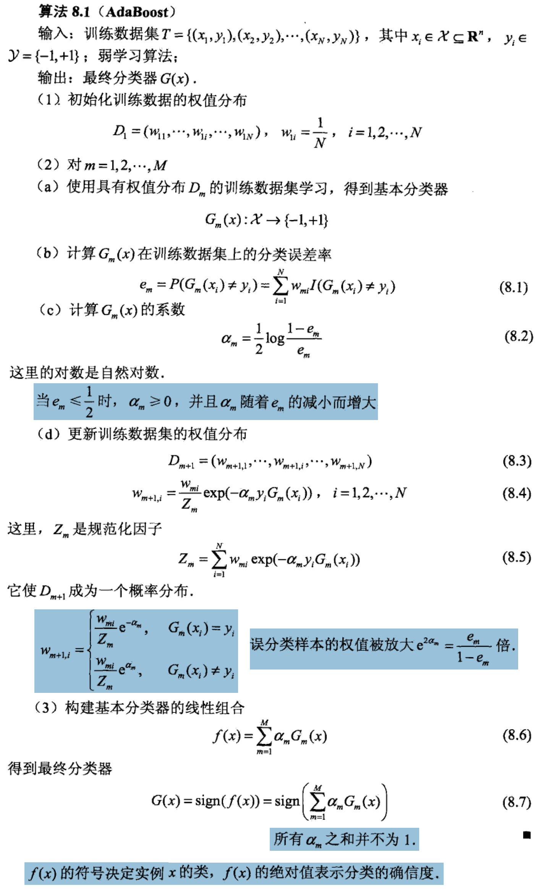
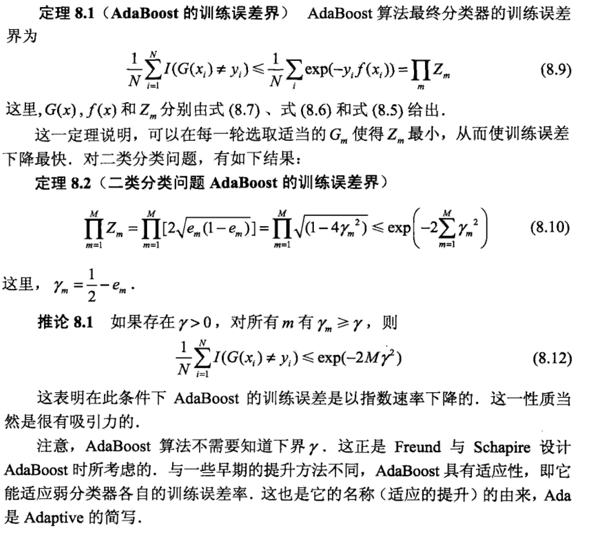
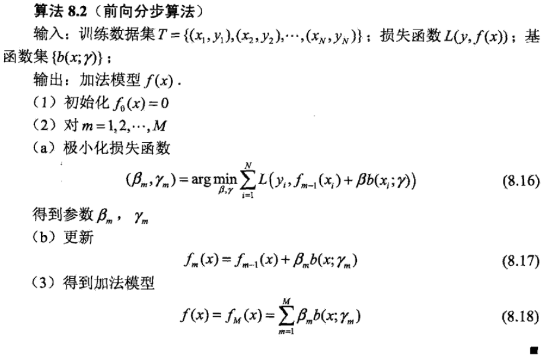
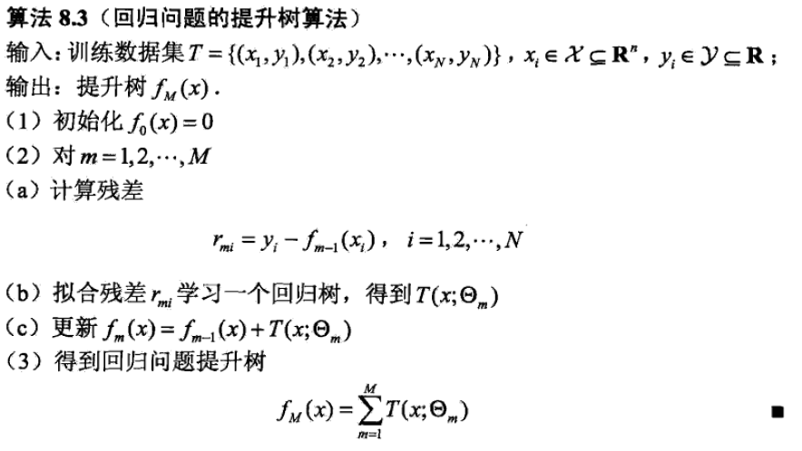
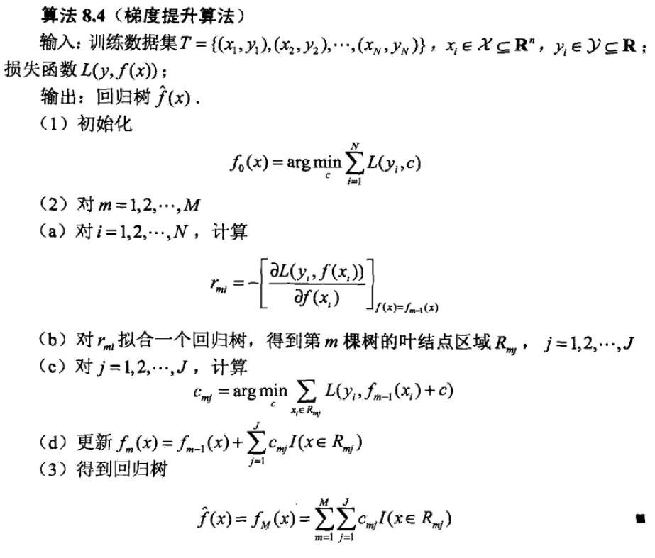

# Boosting

Boosting can improve the performance classifier by combining a bunch of weak learner.

### Background:
The concept of Boosting is related to the PAC learning theory. 
Under a probably approximately correct PAC framework, a strong learnable class/concept is equivlent to a weakly learnable class. 
That's to say, if we already has a weak learner, how to improve it to a strong learner.

Most of the boosting method is to 1) change the weights of training data 2) apply the weak algorithm to the data repeatly to develop a set
of weak learner 3) combine those weak learners together. So there are two key questions in boosting:
+ How to change the weights of the training data?
+ How to combine the weak learners?

It including the following methods:
+ AdaBoost (Freund and Schapire in 1995)
+ Boosting tree (Friedman et al. in 2000)
+ Gradient boosting (Friedman at al.)

## AdaBoost
AdaBoost can be used in the following scenarios:
+ two sets classifiction problems.
+ multiple sets classifiction problems. **(Pending)**

We focus on the two sets classifiction problems in this notes.

#### The alorithm of adaboost:

#### The property of adaboost:

#### Another way to interpret Adaboost:
using a general boosting framework:
+ Model: additive model
+ Loss function: exponential loss function
+ Learning algorithm: forward stagewise algorithm

## Boosting Tree
Boosting Tree can be used in both classification and regression problems. It equals additive model + forward stagewise algorithm.

| problem | base function | loss function |
|--|--|--|
| classification | binary classification tree | exponential loss function|
| regreesion | binary regression tree | square loss function - residule boosting |
| all | all | other loss function - gradient boosting|

For a classification problem, one can refer to Adaboost

For a regression problem, using square loss function is equivlent to fit the next model by using the residule of the last model.

#### The algorithm of boosting tree.

Some notes for this algotrithm:
+ M is a parameter needs to set up beforehand: How many times do you want to update your learner. 
+ J is a parameter needs to set up beforehand: it depends on the depth of the tree in each step. 

## Gradient Boosting

#### The algorithm of gradient boost.

Some notes for this algotrithm:
+ M is a parameter needs to set up beforehand: How many times do you want to update your learner. 
+ J is a parameter needs to set up beforehand: it depends on the depth of the tree in each step. 

## Citation and Thanks to
李航- 统计学习方法2

[StatQuest with Josh Starmer](https://www.youtube.com/watch?v=3CC4N4z3GJc)

